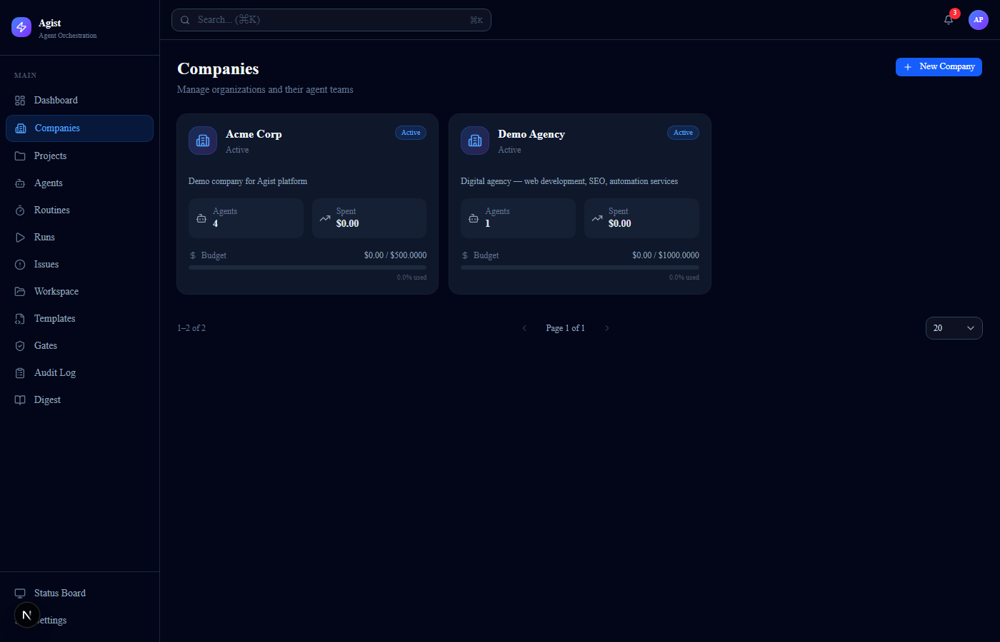
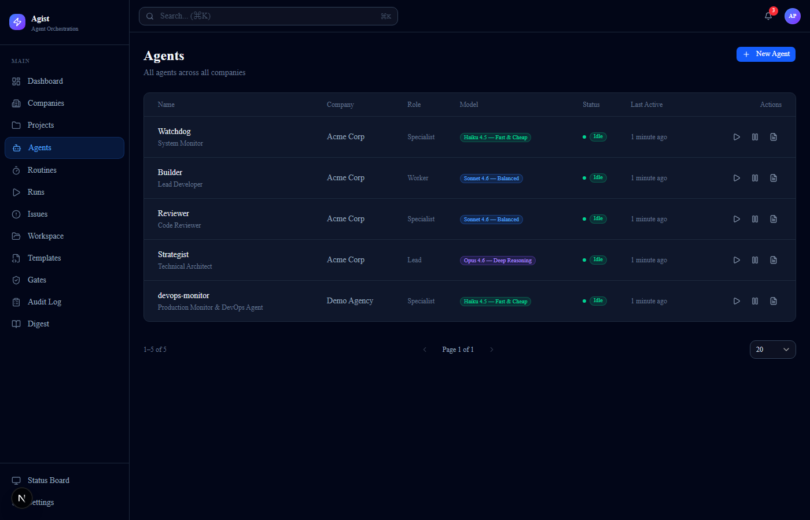

<p align="center">
  
</p>

<h1 align="center">Agist</h1>

<p align="center">
  <strong>The control plane for your AI agent team.</strong><br/>
  Schedule, monitor, and chain Claude and GPT agents — with budget limits,
  approval gates, and a live dashboard. No Postgres. No Redis. No cloud.
</p>

<p align="center">
  <a href="#get-running-in-30-seconds"><strong>Get running in 30 seconds</strong></a>
  &nbsp;&nbsp;|&nbsp;&nbsp;
  <a href="#screenshots">See the dashboard</a>
  &nbsp;&nbsp;|&nbsp;&nbsp;
  <a href="#features">Features</a>
  &nbsp;&nbsp;|&nbsp;&nbsp;
  <a href="#api">API</a>
  &nbsp;&nbsp;|&nbsp;&nbsp;
  <a href="#contributing">Contributing</a>
</p>

<p align="center">
  
  &nbsp;
  
  &nbsp;
  
  &nbsp;
  
  &nbsp;
  
  &nbsp;
  
  &nbsp;
  
</p>

<p align="center">
  
  <sub>Dashboard — live agent fleet, cost breakdown, and recent runs</sub>
</p>

---

## Get Running in 30 Seconds

```bash
npx agist setup   # interactive wizard — sets ports, API keys, data directory
npx agist start   # starts backend + frontend
```

Open **http://localhost:3004**. Done.

> **Requirements:** Node.js 20+, pnpm 9+

**Other options:**

```bash
# Git clone
git clone https://github.com/tahakotil/agist.git && cd agist
pnpm install && pnpm seed && pnpm dev

# Docker (production-ready with automatic TLS via Caddy)
git clone https://github.com/tahakotil/agist.git && cd agist
docker compose up -d
# Custom domain: DOMAIN=agents.yourdomain.com docker compose up -d
```

---

## Why Agist?

If you are running more than two AI agents, you already have a management problem.

One agent writes content on a schedule. Another monitors competitors. Another drafts outreach. They run in separate cron jobs, log to separate files, and you have no idea what they spent last Tuesday or whether one of them silently failed at 3am.

Agist is the operations layer you add on top of your existing agents:

- **One dashboard** — see every agent, every run, and every dollar spent in real time
- **Approval gates** — define which actions require a human yes before they execute
- **Auto-gates** — supervised agents automatically create approval gates for destructive actions
- **Budget guardrails** — per-agent monthly/daily/per-run cost caps with auto-pause
- **Signal bus** — one agent's output triggers the next, without a message broker
- **Context capsules** — per-agent knowledge blocks with staleness tracking, consolidation, and version pruning
- **Agent permissions** — layered trust model (autonomous / supervised / readonly / custom) with company-level inheritance
- **Write discipline** — signal dedup, content-hash guards, output quality gates prevent data pollution
- **Memory consolidation** — automatic cross-session capsule synthesis with gate-stack scheduling
- **Audit log** — every state change, approval decision, and budget event with decision reasons, permanently recorded
- **Multi-adapter** — works with Claude CLI, Anthropic API, OpenAI, or a mock adapter for testing

All of this runs on SQLite. One Node.js process. One Docker container.

---

## Agist vs CrewAI, AutoGen, Paperclip, and Claude Squad

| | Agist | CrewAI | AutoGen | Paperclip | Claude Squad |
|---|---|---|---|---|---|
| Self-hosted | Yes | Partial | Yes | Yes (complex) | Yes |
| Visual dashboard | Yes | No | No | Yes | Terminal TUI |
| Zero-config database | SQLite | Python deps | — | PostgreSQL | — |
| Budget tracking per agent | Yes | No | No | Text only | No |
| Approval gates | Yes | No | No | No | No |
| Agent permission model | Yes | No | No | No | No |
| Memory consolidation | Yes | No | No | No | No |
| Multi-adapter (Claude + OpenAI) | Yes | Limited | Yes | No | No |
| Audit log with decision reasons | Yes | No | No | No | No |
| Single Docker deploy | Yes | No | No | No | No |
| Works without writing code | Yes | No | No | No | No |
| Price | Free & open source | Free / $99+/mo SaaS | Free | Free | Free |

The single differentiator no competitor has simultaneously: **production-ready dashboard + zero infrastructure + budget enforcement + approval gates + agent permission model + memory consolidation**.

---

## Use Cases

**Solo developer running 5+ automation agents**

You have a Claude agent writing daily social posts, another monitoring your competitors, another handling lead research. You want to know: did they all run? What did they spend? Did any fail? Agist gives you a single dashboard instead of five separate log files and zero cost visibility.

**Small engineering team with compliance requirements**

Before agents can call external APIs, send emails, or spend more than $1, a human must approve. Agist's approval gates hold those actions in a queue with full context (what the agent wants to do, what it costs, why). One click to approve or reject. Every decision is in the audit log.

**Multi-tenant agent platform**

You are building a product where each customer gets their own agent team. Agist's company model lets you namespace agents, budgets, and routines per tenant — all sharing one SQLite database, all isolated by company ID.

---

## Features

### One Dashboard for Every Agent Run

See live status, run history, token usage, and cost per agent. The status board (`/status`) is a full-screen wall monitor view. Live logs stream over WebSocket so you watch an agent work in real time.

### Budget Enforcement That Actually Stops Agents

Set a monthly budget per company in cents. Agist tracks cumulative run cost and blocks new runs when the limit is reached — not just alerts, but hard enforcement. The dashboard shows a per-agent cost chart and daily breakdown.

### Approval Gates with Auto-Creation

```
Agent wants to execute an action → Agist creates a pending gate
                                 → You see it in /gates
                                 → Approve or reject with one click
                                 → Agent continues or stops
```

Gate types, titles, descriptions, and payloads are all stored and visible. Every decision is timestamped, logged with a **decision reason**, and recorded in the audit log.

**Auto-gates:** Agents in `supervised` permission mode automatically create approval gates when attempting destructive actions (deploy, delete, budget changes). No manual gate creation needed — the platform enforces the policy.

### Signal Bus — Agent-to-Agent Workflows

Agents post signals (`product-update`, `market-trend`, `alert`, `kpi-change`, etc.) that other agents consume. No message broker. No Kafka. Signal state lives in SQLite. An agent calls `GET /api/companies/:id/signals/unconsumed/:agentId` before each run to pick up what it missed.

### Context Capsules with Staleness Tracking

Each agent can have persistent context capsules — typed knowledge blocks injected into the agent's prompt before each run. Capsules come in three types:

- **Static** — human-written, manually updated
- **Dynamic** — auto-refreshed from agent output
- **Composite** — combines multiple capsules

Capsules support **staleness-aware recall**: each capsule carries a human-readable freshness label ("3 days ago", "2 weeks ago") and stale capsules (30+ days) get a warning caveat injected alongside the content. A **capsule manifest** provides a one-line-per-capsule index sorted by priority (instruction > memory > ephemeral), following the pointer-based index pattern.

### Memory Consolidation Engine

Agist automatically consolidates capsule content across sessions using a gate-stack scheduler inspired by biological memory consolidation:

1. **Scan throttle** — evaluate at most once per 10 minutes
2. **Time gate** — at least 24 hours since last consolidation
3. **Run count gate** — at least 5 completed runs since last consolidation
4. **Lock gate** — distributed lock prevents concurrent consolidations (stale lock detection at 60 minutes)

When all gates pass, the consolidation engine reads all active capsules, identifies stale content, and synthesizes updated versions. Lock rollback on failure ensures the system self-heals.

### Version Pruning and Compaction

Multi-speed compaction prevents unbounded storage growth:

- **Capsule version pruning** — keeps the last 10 versions with full content; older versions are replaced with a pointer to the latest
- **Digest compaction** — digests older than 30 days are compacted to summary-only (detail fields stripped)
- **Run log tiering** — 0-7 days: full log; 7-30 days: truncated to 1,000 chars; 30+ days: metadata only

### Agent Permission Model

A layered trust model controls what each agent can do:

| Mode | Behavior |
|------|----------|
| `autonomous` | All actions permitted, no approval gates |
| `supervised` | Destructive actions (deploy, delete) auto-create approval gates |
| `readonly` | Agent can only perform read/wake operations |
| `custom` | Per-agent capability list governs allowed actions |

Permission inheritance flows **Company > Agent** — a paused or archived company forces all its agents to readonly, regardless of their individual mode. Permission checks use a cheapest-first gate stack: status check (in-memory) > mode check (single column) > budget check (computed) > capability parse (JSON, most expensive).

### Write Discipline

Every write path is guarded by independent gates that default to "do nothing":

- **Signal dedup** — duplicate signals (same type + agent + title within 1 hour) are rejected with 409
- **Capsule content-hash guard** — PUT requests with identical content (SHA-256 match) return immediately without creating a new version
- **Mutual exclusion** — auto-refresh is blocked for 5 minutes after a manual capsule update
- **Output quality gate** — run outputs with confidence < 0.5 are rejected (HTTP 422) instead of persisted
- **Digest generation mutex** — prevents concurrent digest generation for the same company

### Cron Scheduling

Attach routines to agents using standard cron expressions. The scheduler runs every 30 seconds, checks for due routines, and fires runs. Routines are per-company and can be enabled/disabled without deleting them.

### Multi-Adapter Support

| Adapter | How it works |
|---------|-------------|
| `claude-cli` | Spawns a Claude Code process with skill injection |
| `anthropic-api` | Direct Anthropic Messages API call |
| `openai` | OpenAI Chat Completions API |
| `mock` | Simulated run with fake output — useful for testing |

Default: auto-detected from the model name (`gpt-*` → openai, `claude-*` → claude-cli).

### Structured Run Outputs

Agents store typed output objects per run (`POST /api/runs/:runId/outputs`). Query the latest output per agent, the output history for a company, or outputs across an agent's full run history.

### Webhooks

Fire HTTP webhooks on `run.completed`, `run.failed`, `agent.status`, or all events (`*`). Optional HMAC signature via `X-Agist-Signature`. Configure per company.

### Templates — Import / Export Agent Teams

Export a company (agents + routines) as a JSON template. Import it into any Agist instance. Three built-in templates: Content Team, Dev Ops Team, Research Team. Available at `/templates` in the dashboard.

### Governance — Pause and Resume

Pause a company to stop all agent runs immediately. Useful for cost control incidents. Resume resumes all scheduled routines. Every pause/resume event is in the audit log.

### Observability

- Structured JSON logging with configurable `LOG_LEVEL`
- `X-Request-Id` correlation header on every API request
- Prometheus-compatible metrics at `/api/metrics` (HTTP counters, run counters, token counters)
- Run log tiering: full logs (7 days) > truncated (30 days) > metadata only (30+ days)
- Budget cache with 60-second TTL for scheduler performance
- Webhook delivery cache with 30-second TTL for enabled state

---

## Screenshots

<p align="center">
  
  <br/><sub>Companies — multi-tenant agent team management with budget tracking</sub>
</p>

<p align="center">
  
  <br/><sub>Agents — model badge, adapter type, status, and last run at a glance</sub>
</p>

---

## Architecture

```
┌──────────────────────────────────────────────┐
│                  Frontend                     │
│          Next.js 16 + shadcn/ui              │
│          http://localhost:3004                │
│                                              │
│  Dashboard  Agents  Runs  Gates  Templates   │
└─────────────────────┬────────────────────────┘
                      │ REST + WebSocket + SSE
┌─────────────────────┴────────────────────────┐
│                   Backend                     │
│            Hono + TypeScript                 │
│          http://localhost:4400                │
│                                              │
│  REST API  │  WebSocket  │  SSE  │ Scheduler │
│            │             │       │           │
│  Agent Permissions  │  Write Discipline      │
│  Memory Consolidation  │  Version Pruning    │
└─────────────────────┬────────────────────────┘
                      │
┌─────────────────────┴────────────────────────┐
│                  Database                     │
│          SQLite (sql.js, WAL mode)           │
│             ~/.agist/data.db                  │
│                                              │
│  companies  agents  runs  gates  audit_log   │
│  capsules  capsule_versions  signals         │
│  capsule_consolidation  digests              │
└─────────────────────┬────────────────────────┘
                      │
┌─────────────────────┴────────────────────────┐
│           Agent Adapter Layer                 │
│                                              │
│  Claude CLI  │  Anthropic API  │  OpenAI     │
│  Mock — streams logs → WebSocket → Dashboard │
└──────────────────────────────────────────────┘
```

### Tech Stack

| Layer | Technology | Why |
|-------|-----------|-----|
| Frontend | Next.js 16, shadcn/ui, Tremor, React Flow | Fast, typed, component-rich |
| Backend | Hono | 14KB, fastest Node.js framework |
| Database | SQLite via sql.js | Zero config, zero native compilation |
| Real-time | WebSocket + SSE | Bidirectional logs + unidirectional status events |
| Scheduler | cron-parser + setInterval | No external deps, runs every 30s |
| IDs | nanoid | URL-safe, 21 chars |
| Testing | Vitest (782 tests) + Playwright (59 E2E tests) | Full coverage |

### Monorepo Layout

```
packages/
  cli/       — npx agist setup/start/status/logs
  shared/    — TypeScript types, Zod validators, constants
  db/        — SQLite schema, migrations, queries, seed data
  server/    — Hono API (port 4400), WebSocket, SSE, scheduler, adapters
    capsules/  — capsule-manager, capsule-staleness, capsule-consolidation, capsule-pruning
    middleware/ — auth, rbac, rate-limit, agent-permissions
    adapters/  — claude-cli, anthropic-api, openai, mock + AdapterDef interface
  web/       — Next.js dashboard (port 3004)
```

---

## CLI Reference

```bash
npx agist setup              # interactive wizard — ports, API keys, data dir
npx agist start              # start backend + frontend
npx agist status             # server health, agent fleet, KPIs
npx agist logs <agentId>     # stream live logs for one agent (WebSocket)
npx agist logs "*"           # stream all agent logs
```

---

## API

Full OpenAPI spec at `http://localhost:4400/api/docs` once running. Core endpoints:

### Companies
```
GET    /api/companies                   list (paginated, ?search=, ?status=)
POST   /api/companies                   create
PATCH  /api/companies/:id               update
DELETE /api/companies/:id               delete
GET    /api/companies/:id/export        export as AgistTemplate JSON
POST   /api/companies/import            import AgistTemplate JSON
```

### Agents
```
GET    /api/agents                      list all (paginated, ?status=, ?model=, ?search=)
POST   /api/companies/:cid/agents       create
PATCH  /api/agents/:id                  update
DELETE /api/agents/:id                  delete
POST   /api/agents/:id/wake             manual wake {prompt?}
GET    /api/agents/:id/context          get context capsule
PUT    /api/agents/:id/context          update context capsule
```

### Runs
```
GET    /api/runs                        list (paginated, ?status=, ?agentId=, ?from=, ?to=, ?include_system=true)
GET    /api/runs/system                 system/background runs only
GET    /api/runs/:id                    run detail with log excerpt
GET    /api/agents/:id/runs             runs for one agent
DELETE /api/agents/:id/runs             bulk delete (?olderThan=30d, ?status=failed)
```

System runs (source=`system`) are hidden from default listings. Pass `?include_system=true` to include them, or use the dedicated `/api/runs/system` endpoint.

### Approval Gates
```
GET    /api/companies/:cid/gates        list gates (?status=pending)
GET    /api/companies/:cid/gates/pending  pending gates only
POST   /api/companies/:cid/gates        create gate
POST   /api/companies/:cid/gates/:id/approve  approve
POST   /api/companies/:cid/gates/:id/reject   reject
```

### Signals
```
POST   /api/companies/:cid/signals      emit signal
GET    /api/companies/:cid/signals      list signals
GET    /api/companies/:cid/signals/unconsumed/:agentId  unconsumed signals for agent
POST   /api/companies/:cid/signals/:id/consume  mark consumed
```

### Capsules
```
GET    /api/companies/:cid/capsules     list capsules
POST   /api/companies/:cid/capsules     create {type, name, content, config?}
GET    /api/capsules/:id                get capsule with staleness info
PUT    /api/capsules/:id                update (content-hash dedup, auto last_manual_update_at)
DELETE /api/capsules/:id                soft delete
POST   /api/capsules/:id/refresh        refresh dynamic/composite (mutual exclusion: blocked 5min after manual update)
GET    /api/capsules/:id/versions       version history
GET    /api/capsules/:id/versions/:v    specific version
```

### Digest
```
GET    /api/companies/:cid/digest       today's digest
GET    /api/companies/:cid/digest/:date specific date
POST   /api/companies/:cid/digest/generate   manual trigger
POST   /api/companies/:cid/digest/compact    compact old digests (>30 days → summary only)
GET    /api/companies/:cid/digest/range      date range (?from=, ?to=)
```

### Audit Log
```
GET    /api/companies/:cid/audit        list entries (paginated, ?action=, ?agent_id=)
```

Audit entries include `decision_reason` for traceable approval decisions.

### System
```
GET    /api/health                      health check (no auth)
GET    /api/dashboard/stats             KPIs: agents, running, success rate, cost
GET    /api/dashboard/costs?days=7      daily cost breakdown by agent
GET    /api/metrics                     Prometheus-compatible counters
GET    /api/events                      SSE stream (agent.status, run.completed, ...)
WS     ws://localhost:4400/ws           live agent log stream
```

---

## Configuration

All configuration via environment variables. Auth is disabled by default for local dev.

| Variable | Default | Description |
|----------|---------|-------------|
| `AGIST_AUTH_DISABLED` | `true` | Set `false` to require API keys |
| `CORS_ORIGINS` | `http://localhost:3004` | Comma-separated allowed origins |
| `LOG_LEVEL` | `info` | `debug` / `info` / `warn` / `error` |
| `ANTHROPIC_API_KEY` | — | For `anthropic-api` adapter |
| `OPENAI_API_KEY` | — | For `openai` adapter |
| `RUN_TTL_DAYS` | — | Auto-delete runs older than N days |
| `SLACK_WEBHOOK_URL` | — | Slack notification webhook |
| `GITHUB_TOKEN` | — | GitHub issue creation on failures |
| `GITHUB_REPO` | — | `owner/repo` format |

To enable auth:

```bash
AGIST_AUTH_DISABLED=false
```

Then create an API key via `POST /api/api-keys` and include it on all requests:

```bash
curl http://localhost:4400/api/agents -H "X-Api-Key: agist_<your-key>"
```

---

## Roadmap

What is shipped:

- [x] Agent registry (dashboard + API)
- [x] Cron scheduler + manual wake
- [x] Multi-adapter: Claude CLI, Anthropic API, OpenAI, Mock
- [x] Budget enforcement (monthly cap, auto-pause, audit)
- [x] Approval gates (pending queue, approve/reject, audit)
- [x] Signal bus (cross-agent event propagation)
- [x] Context capsules (per-agent markdown knowledge blocks)
- [x] Company templates (import/export, 3 built-in templates)
- [x] Webhooks (run events, HMAC signature)
- [x] Audit log
- [x] Prometheus metrics
- [x] CLI (setup, start, status, logs)
- [x] Docker + Caddy deploy
- [x] 782 unit/integration tests + 59 E2E tests
- [x] Agent permission model (autonomous / supervised / readonly / custom)
- [x] Auto-gate creation for supervised agents
- [x] Write discipline (signal dedup, content-hash guard, output quality gate)
- [x] Capsule staleness tracking with human-readable labels
- [x] Memory consolidation engine (gate-stack scheduler)
- [x] Capsule version pruning and digest compaction
- [x] Run log tiering (full / truncated / archived)
- [x] Silent system runs (hidden from default dashboard)
- [x] Standardized adapter interface (AdapterDef)
- [x] Budget cache and gate-stack ordering for scheduler performance
- [x] Mutual exclusion between manual and auto capsule updates
- [x] Audit log with decision reasons

What is next:

- [ ] Visual workflow builder (drag-and-drop agent chains)
- [ ] Multi-user authentication (RBAC with invite flow)
- [ ] Capsule versioning UI
- [ ] Public agent marketplace / template registry
- [ ] LLM-powered capsule consolidation (Anthropic API integration)
- [ ] Capsule relevance-gated injection (select top-N capsules per run)

See [ROADMAP.md](ROADMAP.md) for the full backlog.

---

## FAQ

**Does Agist work without an Anthropic or OpenAI API key?**

Yes. Use the `mock` adapter for testing or the `claude-cli` adapter if you have Claude Code installed locally. You only need API keys when using the `anthropic-api` or `openai` adapters.

**Is SQLite production-ready here?**

For single-instance deployments managing up to hundreds of agents and thousands of daily runs — yes. SQLite in WAL mode handles concurrent reads well. We use `sql.js` (WebAssembly) which means zero native compilation, so it runs on any platform. If you need multi-writer horizontal scaling, evaluate [Turso](https://turso.tech) or [libSQL](https://github.com/tursodatabase/libsql) as a drop-in upgrade.

**Do my agent outputs or prompts get sent anywhere?**

No. Agist is self-hosted. All data stays in your local SQLite file (`~/.agist/data.db`). The only outbound traffic is what your agent adapters send directly to Anthropic or OpenAI — not routed through any Agist service.

**Can I run multiple companies (tenants) on one instance?**

Yes. Companies are the top-level namespace. Each company has its own agents, routines, budgets, approval gates, and audit log. One SQLite database, fully isolated by company ID.

**How is this different from just using cron + claude CLI directly?**

Cron gives you execution. Agist gives you visibility, cost control, approval gates, structured outputs, cross-agent signals, and a dashboard. The cron is still there — Agist wraps it with everything that makes running multiple agents in production sustainable.

---

## Contributing

Contributions are welcome. See [CONTRIBUTING.md](CONTRIBUTING.md) for setup details, coding conventions, and the PR process.

```bash
git clone https://github.com/tahakotil/agist.git
cd agist
pnpm install
pnpm dev         # backend:4400 + frontend:3004
pnpm test        # 782 tests
pnpm test:e2e    # 59 Playwright tests
```

Good first issues are labeled [`good first issue`](https://github.com/tahakotil/agist/labels/good%20first%20issue) on GitHub.

---

<p align="center">
  If Agist is useful, a star helps other developers find it.
  <br/><br/>
  <a href="https://github.com/tahakotil/agist">
    
  </a>
  <br/><br/>
  Built by <a href="https://github.com/tahakotil">Taha Kotil</a>
</p>
